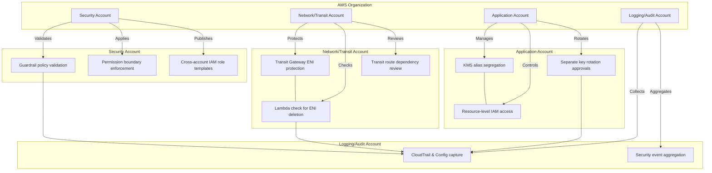

# Architecture Diagram

This diagram shows the AWS account structure and the separate control requirements for each account. The ENI deletion protection and IAM/KMS governance flows are shown independently so the actions are not combined into a single step.

## Diagram

Use this diagram to show each account’s requirements separately, instead of combining ENI deletion control and IAM/KMS governance in one shared workflow.
