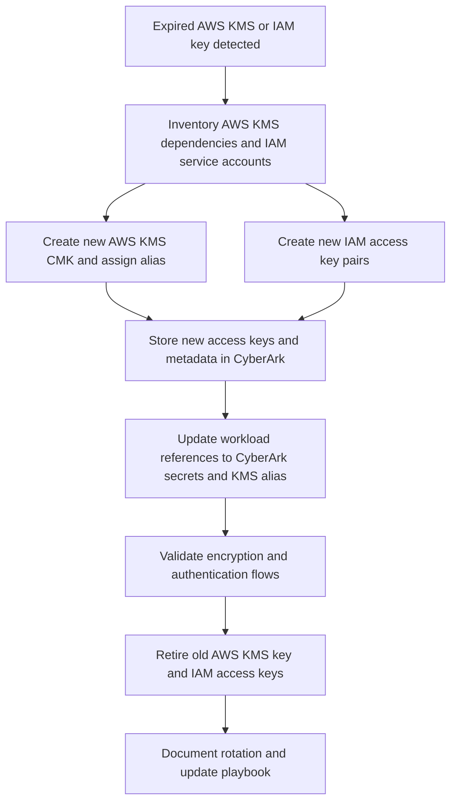

# KMS Key Rotation Diagrams

This folder contains diagrams for the AWS KMS and IAM access key rotation workflow.

## Diagram

Use this diagram to show the AWS-only key rotation flow with CyberArk as the secure vault.
