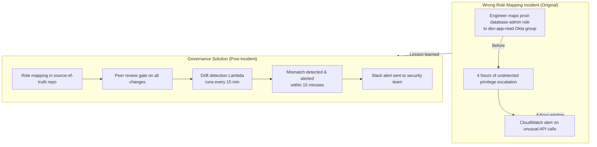
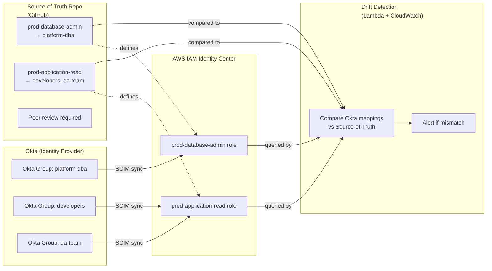

# Okta + AWS Federation Governance Diagrams

This folder contains diagrams for the Okta-to-AWS identity federation workflow with drift detection and incident prevention controls.

## Incident & Resolution Diagram

## Okta-AWS Federation Architecture

Use these diagrams to show the incident scenario and the layered controls that prevent privilege escalation through role misassignment.

