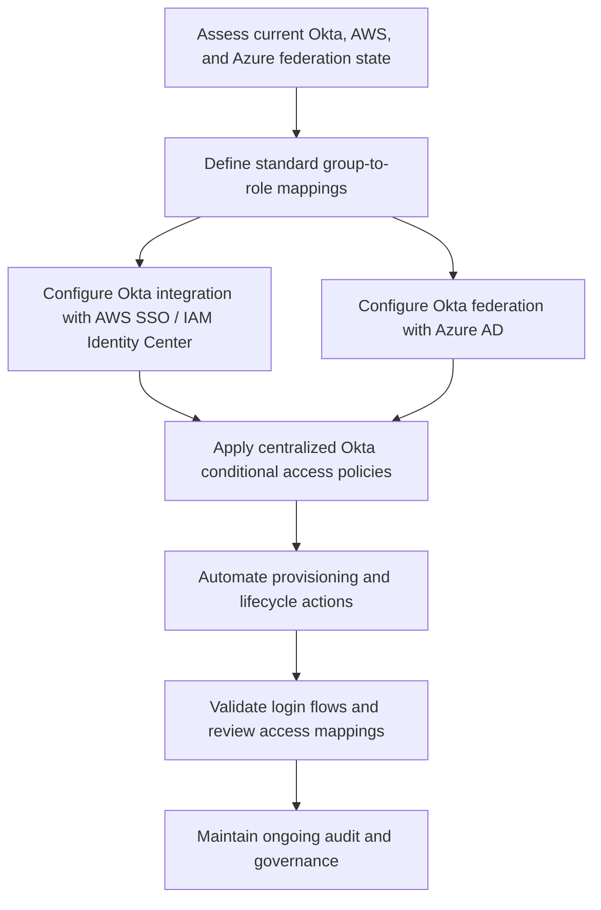

# Okta Identity Federation Diagrams

This folder contains diagrams for the Okta multi-cloud federation workflow.

## Diagram

Use this diagram to show the logical flow from assessment to ongoing governance.
