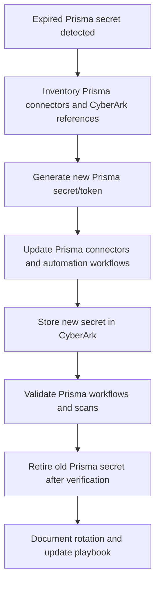

# Prisma Secret Rotation Diagrams

This folder contains diagrams for the Prisma secret rotation workflow.

## Diagram

Use this diagram to show the Prisma-specific rotation flow with CyberArk as the central vault.
