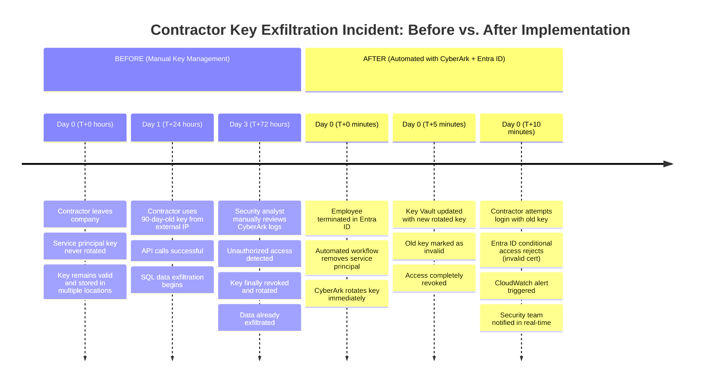
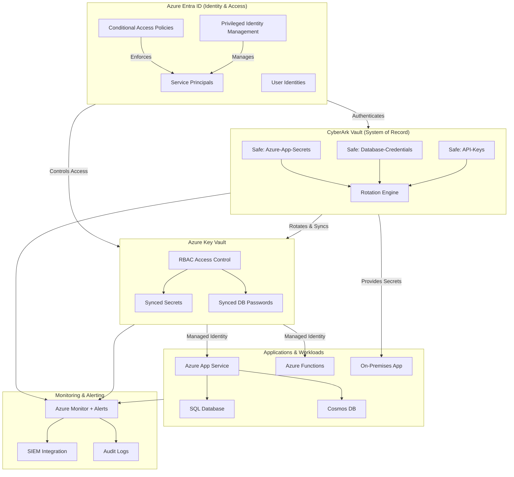
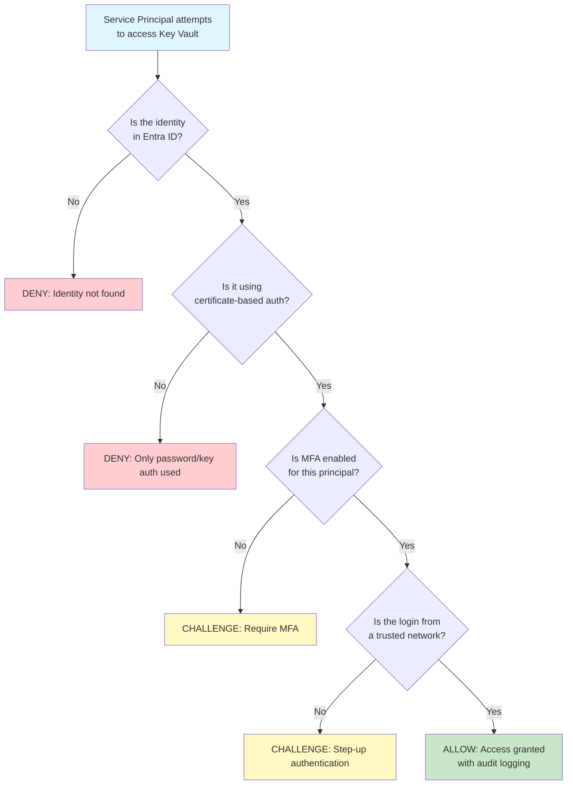
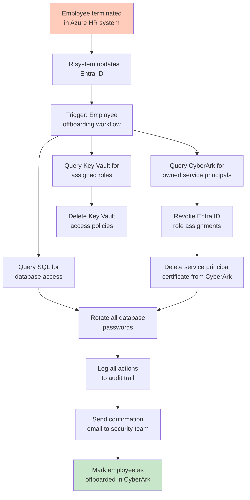
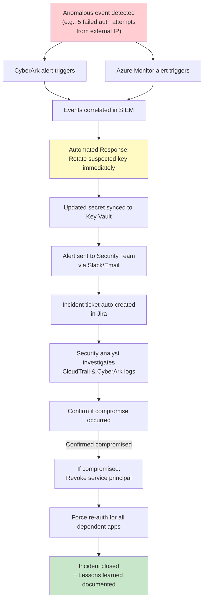
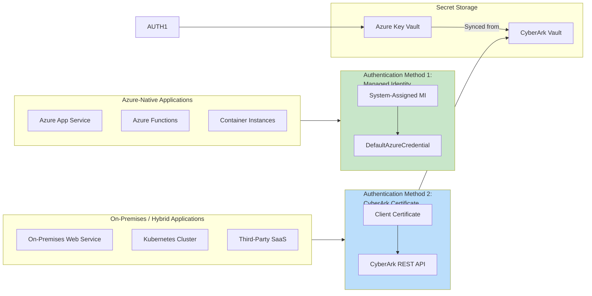
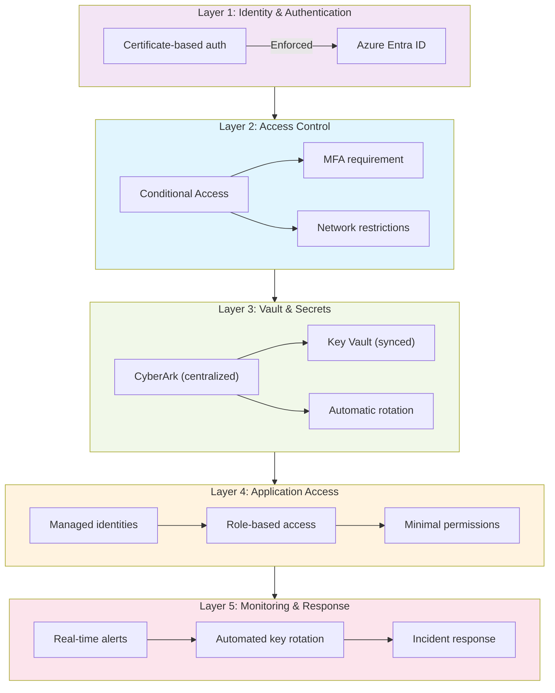

# Azure Entra ID + Key Vault + CyberArk Architecture Diagrams

This folder contains detailed diagrams illustrating the unified secret management architecture.

## Diagram 1: Incident Timeline (Before vs. After)

---

## Diagram 2: Architecture Overview - Azure Entra ID + CyberArk + Key Vault

---

## Diagram 3: Secret Lifecycle Workflow (30-Day Rotation Cycle)

```mermaid
graph LR
    subgraph Day["Day 0-29: Secret Valid"]
        A["Secret stored in CyberArk"]
        B["Synced to Key Vault"]
        C["Applications use secret"]
        A --> B
        B --> C
    end
    
    subgraph Rotation["Day 30: Automated Rotation"]
        D["CyberArk rotation engine triggers"]
        E["New secret generated"]
        F["Old secret backed up"]
        G["New secret stored in CyberArk"]
        D --> E
        E --> F
        F --> G
    end
    
    subgraph Sync["Day 30: Sync to Key Vault"]
        H["REST API call to Key Vault"]
        I["New secret uploaded"]
        J["Old version preserved"]
        H --> I
        I --> J
    end
    
    subgraph AppUpdate["Day 30-31: Application Update"]
        K["App checks Key Vault on next request"]
        L["New secret retrieved"]
        M["Old secret no longer valid"]
        K --> L
        L --> M
    end
    
    subgraph Audit["Day 30+: Audit Trail"]
        N["Rotation logged in CyberArk"]
        O["Key Vault versioning recorded"]
        P["CloudTrail captures all changes"]
        N --> O
        O --> P
    end
    
    C --> D
    G --> H
    J --> K
    M --> N
```

---

## Diagram 4: Entra ID Conditional Access Flow

---

## Diagram 5: Employee Offboarding Workflow (Automated)

---

## Diagram 6: Real-Time Alert & Remediation Flow

---

## Diagram 7: Application Integration Options (Managed Identity vs. CyberArk API)

---

## Diagram 8: Multi-Layer Security Controls

---

Use these diagrams in architecture reviews, security audits, and compliance presentations to communicate the integrated control structure and demonstrate how the architecture prevents incidents like the contractor data exfiltration scenario.
