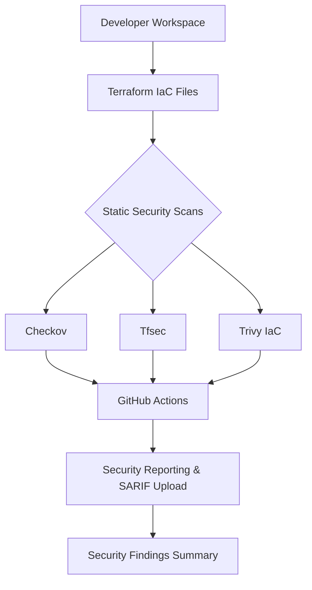

# DevSecOps Infrastructure-as-Code (IaC) Security Pipeline

## Overview
This portfolio project demonstrates shift-left IaC security by combining Terraform configuration with static security analysis and compliance guardrails.

The repository contains:
- `terraform/` with secure and intentionally insecure Terraform resources.
- `.github/workflows/security-scan.yml` for CI/CD scanning on push and pull request events.
- Documentation and examples for local scanning using VS Code terminal.

## Architecture


## Project Layout
```
devsecops-iac-security-pipeline/
├── .github/
│   └── workflows/security-scan.yml
├── terraform/
│   ├── main.tf
│   ├── variables.tf
│   └── outputs.tf
├── .gitignore
└── README.md
```

## Local Setup
### Prerequisites
- Terraform 1.2+ installed
- Python 3.10+ installed
- `pip` available
- Checkov and tfsec installed locally

### Install tools locally
```powershell
# Terraform
choco install terraform -y
# or from https://developer.hashicorp.com/terraform/downloads

# Checkov
python -m pip install --upgrade pip
python -m pip install checkov

# tfsec
choco install tfsec -y
# alternative: scoop install tfsec
```

### Scan the Terraform configuration
```powershell
cd devsecops-iac-security-pipeline\terraform
terraform init
terraform validate
terraform fmt
checkov -d .
tfsec .
```

### Optional Trivy scan
```powershell
trivy config --severity CRITICAL --format json --output trivy-report.json .
```

## Intentional Misconfigurations
- `aws_s3_bucket.insecure_public_bucket`: uses `acl = "public-read"`, exposing bucket objects to the public internet.
- `aws_security_group.insecure_ssh`: allows SSH and RDP ingress from `0.0.0.0/0`.
- `aws_security_group.secure_web`: shows a least-privilege alternative using a trusted CIDR range.

## Security Findings & Mitigation Steps
- Public S3 buckets should be replaced with private ACLs and public access blocking.
- Sensitive ingress ports such as 22 and 3389 should be restricted to known IP ranges or removed entirely.
- Use encryption and policy guardrails for production workloads.

## CI/CD Pipeline
The GitHub Actions workflow in `.github/workflows/security-scan.yml` runs on push and pull request events targeting this folder.
It performs:
- Checkov policy scan
- Trivy IaC scanning
- SARIF report generation for GitHub code scanning
- Build failure on CRITICAL findings

## Diagram Viewer
Open `devsecops-iac-security-pipeline/architecture.html` in your browser to view the architecture flowchart in a simple HTML viewer.
