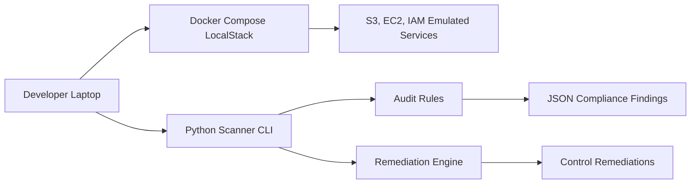

# Local Cloud Threat Detection & Compliance Engine

## Project Overview
This portfolio project builds a local cloud security engine that scans mock AWS resources inside LocalStack, detects misconfigurations, and optionally remediates them.

The repository includes:
- A modular Python scanner and remediation engine
- LocalStack Docker Compose setup for zero-cost local AWS emulation
- An initialization script to create unsafe resources in S3, EC2 security groups, and IAM
- Unit tests with `pytest`
- A polished README with architecture and execution examples
- A GitHub Actions CI workflow for LocalStack integration validation

## Architecture


## Directory Structure
```
local-cloud-threat-detection-compliance-engine/
├── config/
│   └── localstack_resources.json
├── docker-compose.yml
├── pyproject.toml
├── README.md
├── requirements.txt
├── src/
│   └── local_cloud_threat_detection/
│       ├── __init__.py
│       ├── cli.py
│       ├── clients.py
│       ├── init_resources.py
│       ├── output.py
│       ├── scanners/
│       │   ├── iam_scanner.py
│       │   ├── s3_scanner.py
│       │   └── security_group_scanner.py
│       └── remediators/
│           ├── s3_remediator.py
│           └── security_group_remediator.py
├── tests/
│   └── test_scanners.py
└── architecture.html
```

## Prerequisites
- Docker or Docker Desktop installed
- Python 3.10+ installed
- `pip` available

## Local Setup
```powershell
cd local-cloud-threat-detection-compliance-engine
python -m pip install --upgrade pip
python -m pip install -r requirements.txt
python -m pip install -e .
```

## Continuous Integration
A GitHub Actions workflow is configured to run on every push and pull request that touches this folder.
The CI pipeline will:
- start LocalStack via Docker Compose
- initialize mock insecure cloud resources
- run the scanner and remediation CLI flows
- execute unit tests with `pytest`

## Start LocalStack
```powershell
docker compose up -d
```

## Initialize mock cloud resources
```powershell
python -m local_cloud_threat_detection.cli --init
```

## Run the scanner
```powershell
python -m local_cloud_threat_detection.cli
```

## Run the scanner with remediation
```powershell
python -m local_cloud_threat_detection.cli --fix
```

## Run tests
```powershell
python -m pytest tests
```

## Sample output
```json
{
  "findings": [
    {
      "resource_type": "s3",
      "resource_id": "localstack-demo-insecure-bucket",
      "issue": "missing public access block",
      "suggested_fix": "Enable S3 Block Public Access and server-side encryption."
    }
  ]
}
```

## Diagram Viewer
Open `local-cloud-threat-detection-compliance-engine/architecture.html` in your browser to view the architecture diagram.
